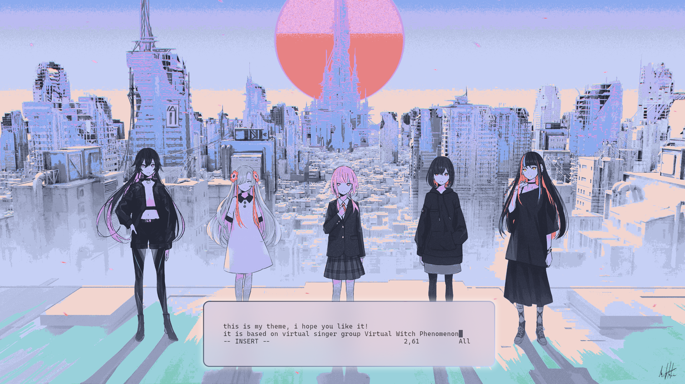
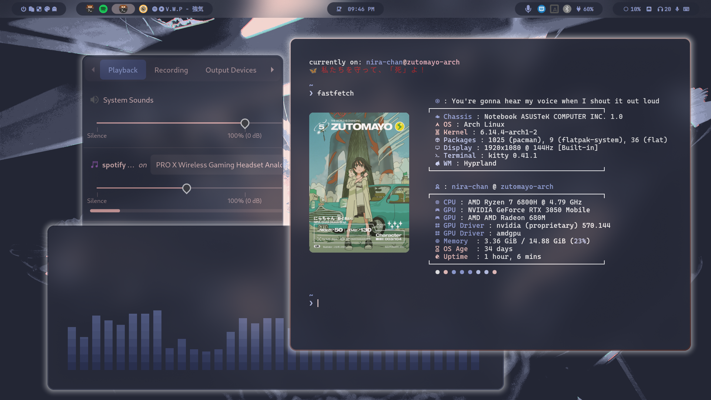
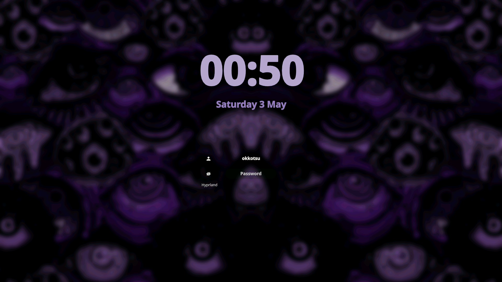

<div align = center>
    <a href="https://discord.gg/tGGFXtND">
            
    </a>
</div>
<div align = center><br><br></div>

> [!IMPORTANT]
> This is not a standalone theme, needs [HyDe](https://github.com/HyDE-Project/HyDE) installed...

## Theme Screenshots



## SDDM theme screenshot


## Installation

For hyprdots (old)
```sh
Hyde theme import "Obsidian-Purple" "https://github.com/amit-0i/Obsidian-Purple"
```

For HyDE (new)
```sh
hydectl theme import
```

and choose Obsidian-Purple


### Applying SDDM theme

```sh

sudo nano /etc/sddm.conf.d/the_hyde_project.conf

```
```
[Theme] 
Current=Obsidian-Purple
```

---

or install another theme from [HyDe Gallery](https://github.com/kRHYME7/hyde-gallery)
